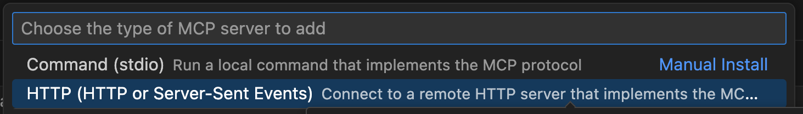
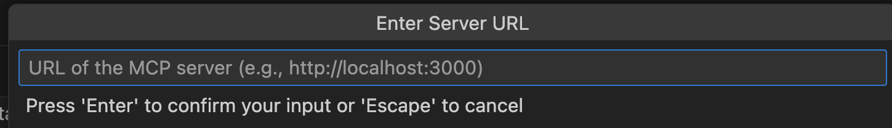
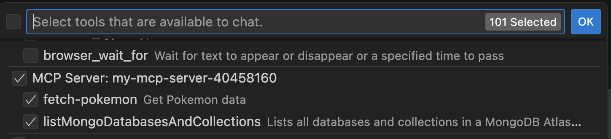
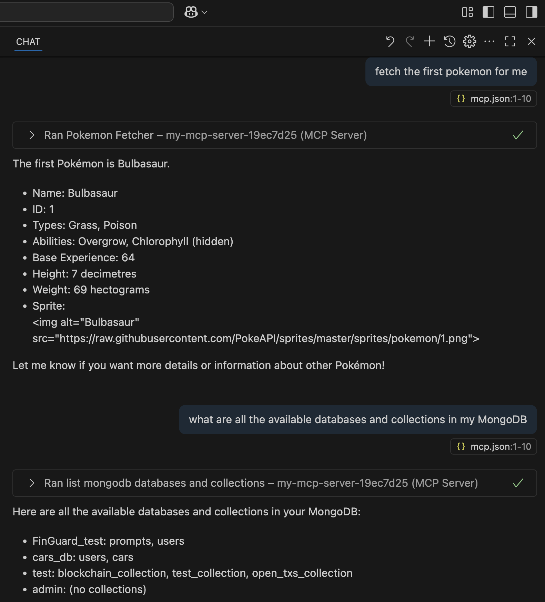

# Stateful streamablehttp-mcp-server with Node.js

## Overview

Most tutorials on MCP (Model Context Protocol) Servers are using `stdio` protocols (i.e. not for remote connections) and are `Stateless` and very limited in functionaties (e.g. in terms of how to build Tools/Resources)...thus I decided to build and share this robust and easy-to-extend template `Stateful` MCP Server with the `Streamable-http transport`.

This is perhalps the easiest to use fully-functioning template for you to build your own `Node.js` STATEFUL MCP Server using the `Streamable-http transport`, with a modular folder structure for `Tools`, `Resources` and `server` and an in-memory database (i.e.`Node-Cache`) for managing stateful `transport` objects which further boosts server performance.

It is designed for easy extension and integration, allowing you to add your own tools and resources for custom workflows.

Nevertheless I have also built some out-of-the-box Tools and Resources for you as helpful examples:

1. **For Tools**:

   By default, two simple yet realistic tools, i.e. a Database tool and an API tool, are loaded for you and you can directly extend the template with your own tools:

- `listMongoDatabasesAndCollections`: which allows you to List all databases and collections in a MongoDB Atlas cluster

- `fetch-pokemon`: which allows you to fetch a certain Pokemon of your liking

2. **For Resources**:

   By default, both ways of loading Resources are provided in the template for you. Namely, loading a Dynamic resource with parameters and loading a Static resource without parameters

---

## Quick Start guide

1. **git clone and install dependencies:**

   ```sh
   git clone https://github.com/HarveyYifanLi/Template-Nodejs-MCP-Server.git

   cd Template-Nodejs-MCP-Server

   npm install

   (Note that depending on your directory permission setting, you might need to do:
   `sudo npm install` instead)
   ```

2. **Start the server:** (Requires Node.js 18+ for native fetch and ESM support).

   ```sh
   node app.js
   ```

   The server will listen on port `3001` by default.

   You can now directly connect to this MCP Server at `http://localhost:3001/mcp` from any MCP Host that runs a MCP Client. See next section for examples.

## Using Tools and Resources

- The server loads and registers all tools and resources from `tools/` and `resources/` via `server/index.js`.
- You can call tools and resources via the MCP protocol endpoints (`/mcp`).
- See `app.js` and `server/index.js` for the registration and request handling logic.

---

## Extending the App

### Adding Custom Tools

1. **Create a new tool module in `tools/`:**

   ```js
   // tools/myCustomTool.js
   export function createMyCustomTool() {
     return {
       name: 'my-custom-tool',
       title: 'My Custom Tool',
       description: 'Describe what your tool does',
       inputSchema: {
         /* zod schema */
       },
       async execute(args) {
         // Your tool logic here
         return { content: [{ type: 'text', text: 'Result!' }] };
       },
     };
   }
   ```

2. **Export your tool in `tools/index.js`:**

   ```js
   import { createMyCustomTool } from './myCustomTool.js';
   export { createListMongoTool, createFetchPokemonTool, createMyCustomTool };
   ```

3. **Register your tool in `server/index.js`:**
   ```js
   import { createMyCustomTool } from '../tools/index.js';
   server.registerTool(
     createMyCustomTool().name,
     { ...createMyCustomTool() },
     createMyCustomTool().execute
   );
   ```

### Adding Custom Resources

1. **Create a new resource module in `resources/`:**

   ```js
   // resources/myResource.js
   export function createMyResource() {
     return {
       name: 'my-resource',
       resourceUri: 'myresource://example',
       title: 'My Resource',
       description: 'Describe your resource',
       async execute(uri, params) {
         return { contents: [{ uri: uri.href, text: 'Resource data!' }] };
       },
     };
   }
   ```

2. **Export your resource in `resources/index.js`:**

   ```js
   import { createMyResource } from './myResource.js';
   export {
     createAppConfigResource,
     createUserProfileResource,
     createMyResource,
   };
   ```

3. **Register your resource in `server/index.js`:**
   ```js
   import { createMyResource } from '../resources/index.js';
   server.registerResource(
     createMyResource().name,
     createMyResource().resourceUri,
     {
       title: createMyResource().title,
       description: createMyResource().description,
     },
     createMyResource().execute
   );
   ```

---

## MCP Client Connection guide:

1. **Connecting from GitHub Copilot**

   - (I've ALREADY included the folowing directory and file to this repo but in case you are curious about how, see the below two steps)
   - within the root of `/Template-Nodejs-MCP-Server` create a .vscode directory with a file named `mcp.json`
   - copy and paste the following content to `mcp.json` to allow connection to this local MCP Server:

   ```
   {
   "servers": {
       "my-mcp-server": {
       "url": "http://localhost:3001/mcp",
       "type": "http"
       }
   },
   "inputs": []
   }
   ```

   - (I assume you already enabled GitHub Copilot to VSCode...if not plz do so)
     In VSCode, open `View/Command Palette`and under the dropdown, select the option called `MCP: Add Server...`

   - (See picture) Choose the HTTP option for connection.
     

   - (See picture) Enter this local MCP Server URL `http://localhost:3001/mcp` into the input box and press 'Enter' to Continue. Then Choose "Workspace" and press 'Enter' to Continue.
     

   - Then you should be able to see the listed MCP Tools available to use from this MCP server
     

   - Now you can directly interact with GitHub Copilot Agent to call/use these tools via natural language:
     

---

## Extra Configuration Note

1. **Environment Variables:**
   - Copy `.env.example` to `.env` (or create `.env` manually).
   - Required variables (IF you decided to extend and use the `listMongoDatabasesAndCollections` tool):
     - `MONGODB_URI`
